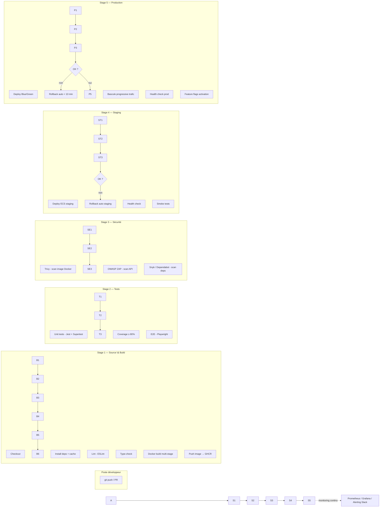

# Architecture du pipeline CI/CD — NovaTech / HRFlow

## 

## 1\. Contexte et objectif

L'audit Partech (18/09/2024) a identifié trois risques majeurs sur la chaîne de livraison actuelle :

1. Aucun pipeline structuré (`.github/workflows/deploy.yml` = `npm install \&\& npm build`, sans test ni lint).
2. Déploiement manuel en SSH (`alias deploy="ssh prod 'cd /app \&\& git pull \&\& pm2 restart all'"`), sans rollback documenté.
3. Secrets (AWS, Stripe, JWT) commités en clair dans le repo.

L'objectif du pipeline cible est de supprimer toute intervention manuelle entre le `git push` et la production,
tout en garantissant un rollback en moins de 10 minutes et un SLA de 99,5 %.

## 2\. Périmètre technique

Le repo NovaTech contient 5 unités déployables indépendamment, chacune avec son propre pipeline (matrice CI) :

|Unité|Rôle|Techno|
|-|-|-|
|`front`|Application React|React 18|
|`api-gateway`|Point d'entrée API, auth, routage|Node.js / Express|
|`service-paie`|Calcul et gestion de la paie|Node.js|
|`service-conges`|Gestion des congés|Node.js|
|`service-recrutement`|Module de recrutement|Node.js|

Chaque unité est packagée en image Docker distincte (cf. `/docker`), ce qui permet des déploiements et
des rollbacks indépendants service par service — point critique vu l'incident d'août (une seule migration
avait fait tomber toute la plateforme).

## 3\. Schéma d'architecture du pipeline (5 stages)

## 4\. Détail des gates (critères de passage entre stages)

|Stage|Gate de sortie|Action si échec|
|-|-|-|
|1 — Build|Lint 0 erreur bloquante, type-check OK, build Docker réussi|Pipeline stoppé, PR bloquée|
|2 — Tests|Coverage ≥ 80 % sur routes critiques, E2E 100 % passés|Pipeline stoppé, merge impossible|
|3 — Sécurité|0 CRITICAL Trivy, 0 High ZAP|Pipeline stoppé + notification Slack sécurité|
|4 — Staging|Health check 200, smoke tests OK|Rollback auto staging, pas de promotion en prod|
|5 — Production|Health check post bascule OK|Rollback auto Blue/Green < 10 min + alerte PagerDuty|

## 

## 5\. Pourquoi cette architecture (justification des choix)

* **Images Docker par service** plutôt qu'un monolithe déployé en bloc : permet un rollback ciblé
(ex. rollback `service-paie` seul, sans toucher `service-conges`) — répond directement au risque
identifié lors de l'incident d'août.
* **Stage Sécurité avant Staging** (et non seulement avant prod) : détecte les vulnérabilités le plus tôt
possible dans le pipeline (shift-left), conformément à la compétence BC03 "Ops".
* **Health check + smoke tests obligatoires avant promotion** : évite de reproduire l'incident où
personne n'a été alerté automatiquement avant l'appel client à 2h15.
* **Feature flags en sortie de déploiement prod** : découple déploiement (technique) et release (métier) —
permet à Camille et Rayan de merger en continu sans exposer une fonctionnalité incomplète (cf. stratégie
Git, doc 02).

