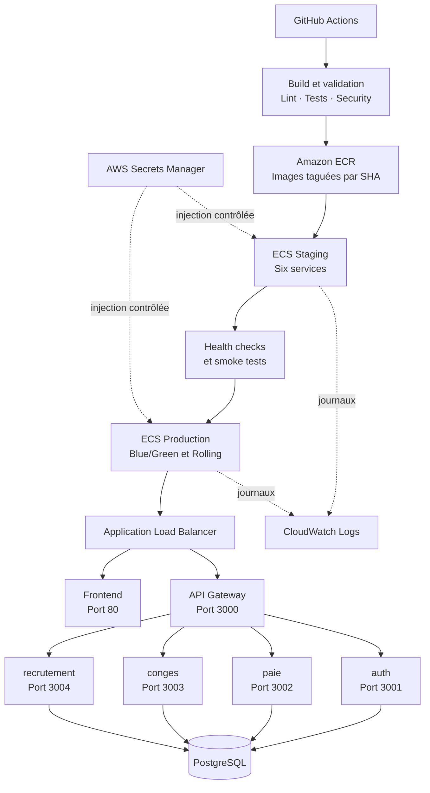

# Architecture cible — Livrable J3

## Statut du document

Ce document décrit l'architecture **prévue** avant l'écriture de Terraform. Il
ne constitue pas une preuve de déploiement.

État connu au moment de sa rédaction :

- **prévu** : l'ensemble de l'architecture AWS décrite ci-dessous ;
- **implémenté** : le contrat des composants, le Dockerfile et le
  `.dockerignore` du service `auth`, ainsi que son lockfile ;
- **testé localement** : les images `auth` ont été construites avec Docker,
  dont un build sans cache utilisant `npm ci --omit=dev` ;
- **non créé et non testé** : toute ressource AWS, tout repository ECR, tout
  service ECS, tout ALB, toute base RDS, tout secret AWS, tout rôle OIDC et tout
  déploiement staging ou production.

Les conventions de composants, ports, images et variables sont définies dans
[`j3-component-contract.md`](./j3-component-contract.md).

## 1. Objectifs du livrable J3

Le J3 doit fournir une infrastructure cloud opérationnelle, reproductible par
Infrastructure as Code et compatible avec les exigences suivantes :

- provisionner AWS avec Terraform ;
- publier des images versionnées dans Amazon ECR ;
- exécuter les six composants avec AWS ECS Fargate ;
- séparer staging et production ;
- automatiser le déploiement en staging ;
- valider les déploiements par health checks et smoke tests ;
- déployer sans interruption ;
- démontrer un feature flag ;
- démontrer un rollback en moins de dix minutes.

La promotion en production doit réutiliser les mêmes digests d'images que ceux
validés en staging. Elle ne doit pas reconstruire les artefacts.

## 2. Situation actuelle et risques identifiés

L'audit Partech décrit un niveau de risque critique : déploiement SSH manuel,
absence de gates qualité, secrets historiques dans Git, staging exposé, absence
de monitoring et logs accessibles publiquement. Le post-mortem d'août 2024
ajoute l'absence de rollback documenté, de sauvegarde suffisamment récente et
d'alerte automatique.

Risques qui influencent directement J3 :

- un déploiement ne doit plus dépendre d'un accès SSH ;
- staging ne doit pas exposer directement les services métier ;
- aucune valeur sensible ne doit entrer dans Git, une image ou un log ;
- les versions déployées doivent être identifiables par SHA Git ;
- un échec de santé doit bloquer la promotion ou déclencher un rollback ;
- la base PostgreSQL doit être protégée des accès publics ;
- le retour à une version antérieure doit être préparé et chronométrable.

Ces risques ne sont pas encore corrigés par une infrastructure AWS existante.

## 3. Choix de Terraform comme Infrastructure as Code

Terraform est retenu pour décrire le réseau, ECR, ECS, ALB, RDS, IAM, Secrets
Manager, CloudWatch et les mécanismes de déploiement. Ce choix permet :

- une revue des changements avec `terraform plan` ;
- une reconstruction documentée des environnements ;
- une séparation des variables staging et production ;
- des validations locales avec `terraform fmt` et `terraform validate` ;
- une destruction contrôlée des ressources payantes après la démonstration.

Le dossier Terraform n'existe pas encore. Le backend d'état, la région AWS et
le compte cible restent à confirmer. Aucun `plan`, `apply` ou `destroy` connecté
à AWS n'a été exécuté.

## 4. Choix d'AWS ECS Fargate

ECS Fargate est retenu plutôt qu'EC2 pour éviter la gestion d'instances, des
correctifs système et d'un autoscaling d'hôtes pendant le workshop. Chaque
composant sera décrit par une task definition et un service ECS.

Dimensionnement initial prévu :

- une tâche de faible capacité par service actif ;
- CPU et mémoire ajustés après observation, sans valeur définitive à ce stade ;
- deux tâches temporaires pendant une bascule ou un rolling deployment ;
- staging réduit à zéro hors validation si cela reste compatible avec la
  démonstration.

Ce dimensionnement est provisoire et devra être confirmé par les limites des
images et les tests.

## 5. Rôle d'Amazon ECR

Six repositories ECR sont prévus, un par nom normalisé :

- `novatech/frontend`
- `novatech/api-gateway`
- `novatech/auth`
- `novatech/paie`
- `novatech/conges`
- `novatech/recrutement`

Les images porteront le tag immuable `sha-<sha-git-complet>`. Les task
definitions ne référenceront pas `latest`. Une politique de cycle de vie devra
limiter le nombre d'anciennes images. Le scan ECR complète, sans remplacer, le
stage Security prévu en J2.

Aucun repository ECR n'est actuellement créé et aucune image n'y a été poussée.

## 6. Architecture réseau AWS

L'architecture prévue utilise un VPC réparti sur au moins deux zones de
disponibilité :

- deux subnets publics pour l'ALB ;
- des subnets de données non publics pour PostgreSQL ;
- des security groups distincts pour l'ALB, les tâches ECS et PostgreSQL ;
- aucune entrée SSH ;
- accès aux ports applicatifs ECS uniquement depuis les composants autorisés ;
- accès PostgreSQL uniquement depuis les tâches qui en dépendent.

Pour limiter le coût du workshop, aucun NAT Gateway n'est prévu sans
autorisation. Le compromis envisagé consiste à placer les tâches Fargate dans
des subnets avec une route Internet et une IP publique pour leurs flux sortants,
tout en refusant tout trafic entrant autre que celui autorisé par les security
groups. Pour une production réelle, des tâches privées avec VPC endpoints ou
NAT contrôlé seraient préférables.

La région, les plages CIDR et les zones ne sont pas encore confirmées.

## 7. Rôle de l'Application Load Balancer

Un seul ALB est prévu afin de limiter le coût. Il assurera :

- l'entrée HTTP/HTTPS vers le frontend et l'API Gateway ;
- les règles de routage staging et production ;
- les health checks des target groups ;
- la bascule entre target groups blue et green ;
- l'absence d'accès direct aux tâches.

Les listeners, noms DNS, certificats et règles finales ne sont pas encore
définis. Aucun certificat ou domaine ne doit être supposé existant.

## 8. Organisation des six composants

| Composant | Port cible | Rôle ECS prévu | Accès |
|---|---:|---|---|
| `frontend` | 80 | Service web Nginx | Public via ALB |
| `api-gateway` | 3000 | Point d'entrée API | Public via ALB sur `/api/*` |
| `auth` | 3001 | Authentification | Interne |
| `paie` | 3002 | Gestion de la paie | Interne |
| `conges` | 3003 | Gestion des congés | Interne |
| `recrutement` | 3004 | Gestion du recrutement | Interne |

Les chemins Docker et commandes de démarrage restent ceux du contrat des
composants. Seule l'image `auth` a actuellement fait l'objet d'un build local
réussi et reproductible par lockfile.

## 9. Séparation entre staging et production

La séparation prévue porte au minimum sur :

- services et task definitions ECS ;
- variables non sensibles ;
- secrets Secrets Manager ;
- bases et comptes PostgreSQL ;
- groupes de logs CloudWatch ;
- target groups et règles ALB ;
- namespaces de découverte interne ;
- historique des déploiements.

Les noms suivent `novatech-<environment>-<component>-<resource>`, avec
`staging` ou `production`.

Pour réduire les ressources, un cluster ECS partagé est envisagé avec des
services strictement séparés par environnement. Ce choix est provisoire. Deux
clusters amélioreraient l'isolation, mais ne sont pas nécessaires pour une
démonstration si les frontières précédentes sont effectivement appliquées.

## 10. Exposition publique du frontend et de l'API Gateway

Seuls le frontend et l'API Gateway seront enregistrés sur des règles publiques
de l'ALB. Les tâches ne devront pas accepter de trafic direct depuis Internet.

Le frontend utilisera `REACT_APP_API_URL` au moment de sa construction ou une
configuration runtime à définir. L'API Gateway recevra les URL internes des
quatre services. Aucun domaine public définitif n'est connu.

## 11. Communication interne avec auth, paie, conges et recrutement

Une découverte privée avec AWS Cloud Map ou ECS Service Connect est prévue.
Les URL contractuelles sont :

```text
AUTH_SERVICE_URL=http://auth.<environment>.novatech.local:3001
PAIE_SERVICE_URL=http://paie.<environment>.novatech.local:3002
CONGES_SERVICE_URL=http://conges.<environment>.novatech.local:3003
RECRUTEMENT_SERVICE_URL=http://recrutement.<environment>.novatech.local:3004
```

Seuls les noms de variables et formes d'URL sont documentés. Le namespace
`novatech.local` est provisoire. Le choix final entre Cloud Map et Service
Connect doit être validé avant Terraform.

Le code de l'API Gateway utilise encore `localhost` et devra être adapté avant
un déploiement ECS.

## 12. Gestion de PostgreSQL

RDS PostgreSQL est prévu avec :

- chiffrement au repos ;
- accès non public ;
- security group limité aux services ECS concernés ;
- identifiants injectés par Secrets Manager ;
- sauvegardes activées avec une rétention compatible avec le budget ;
- bases et comptes logiquement séparés entre staging et production.

Pour le workshop, une seule petite instance RDS Single-AZ avec deux bases et
deux comptes distincts est envisagée afin de limiter le coût. Ce compromis ne
fournit pas une isolation physique ni une haute disponibilité complète. Une
production réelle devrait utiliser des instances ou clusters séparés et une
stratégie de sauvegarde testée.

Aucune instance, base, migration ou sauvegarde AWS n'existe à ce stade.

## 13. Décision concernant Redis

Redis est mentionné dans l'énoncé et la documentation historique, mais aucune
utilisation n'est confirmée dans le code inspecté. Aucun ElastiCache ne sera
créé tant qu'une dépendance fonctionnelle réelle n'est pas démontrée.

Un module Terraform optionnel pourra être envisagé ultérieurement, désactivé
par défaut. Cette décision évite un coût et une surface opérationnelle sans
usage prouvé.

## 14. Gestion des secrets avec AWS Secrets Manager

Secrets Manager est prévu pour les données sensibles de staging et production.
Terraform décrira les conteneurs de secrets, les politiques IAM et les
références ECS, mais aucune valeur sensible ne devra être écrite dans les
fichiers Terraform, les variables versionnées ou les workflows.

Les task definitions référenceront les secrets nécessaires par composant. Les
logs ne devront jamais afficher leur valeur. La rotation des anciennes valeurs
et la suppression de valeurs historiques de Git relèvent d'une opération de
sécurité séparée et contrôlée.

## 15. Authentification de GitHub Actions avec AWS OIDC

GitHub Actions utilisera un fournisseur OIDC AWS et un rôle IAM limité :

- aucune clé AWS longue durée stockée dans GitHub ;
- relation de confiance limitée au repository et aux branches/environnements
  autorisés ;
- permissions séparées entre publication ECR, staging et production ;
- élévation minimale nécessaire à chaque job.

Le repository GitHub, son propriétaire et les conditions OIDC exactes restent
à confirmer. Aucun rôle IAM n'est actuellement créé.

## 16. Déploiement automatisé en staging

Après réussite des stages Build, Test et Security, le pipeline prévu :

1. construit les six images ;
2. les tague avec le SHA Git ;
3. les pousse dans ECR ;
4. enregistre les task definitions staging ;
5. met à jour les services staging ;
6. attend la stabilité ECS ;
7. vérifie les target groups ;
8. exécute les smoke tests ;
9. bloque la promotion si une validation échoue.

Ce pipeline n'est pas encore implémenté ni exécuté.

## 17. Health checks et smoke tests

Chaque composant doit fournir `GET /health` sans modifier de donnée ni révéler
de secret. État connu :

- API Gateway : route existante ;
- frontend : route Nginx prévue, absente du dépôt actuel ;
- auth, paie, conges et recrutement : routes à créer.

Les health checks seront utilisés à trois niveaux :

- `HEALTHCHECK` de l'image lorsque pertinent ;
- health check du target group ALB pour les services exposés ;
- smoke tests après déploiement.

Les smoke tests vérifieront au minimum le frontend, l'API Gateway et des
parcours critiques sans mutation dangereuse. Aucun smoke test J3 n'est encore
implémenté ou exécuté.

## 18. Déploiement Blue/Green du frontend et de l'API Gateway

Le frontend et l'API Gateway utiliseront un déploiement Blue/Green piloté par
ECS et CodeDeploy :

- un target group blue actif ;
- un target group green recevant la nouvelle task definition ;
- des health checks et smoke tests sur green ;
- bascule du listener après validation ;
- conservation temporaire de blue pour un rollback rapide.

Les durées de drainage, fenêtre de conservation et conditions de bascule
restent à définir. Aucun target group ni déploiement Blue/Green n'existe encore.

## 19. Déploiement zero-downtime des services internes

Les services `auth`, `paie`, `conges` et `recrutement` utiliseront un rolling
deployment ECS avec :

- `minimumHealthyPercent` prévu à 100 ;
- `maximumPercent` prévu à 200 ;
- circuit breaker ECS ;
- rollback automatique en cas d'échec de stabilisation ;
- task definition précédente conservée.

Ces valeurs sont des choix cibles et devront être validées avec les contraintes
de capacité et de budget.

## 20. Stratégie de feature flag

Le premier flag envisagé concerne `recrutement-v2`, cohérent avec le contexte
du dépôt. Une variable telle que `FEATURE_RECRUTEMENT_V2_ENABLED` peut fournir
un premier mécanisme sans reconstruire l'image.

Ce mécanisme par task definition nécessite toutefois un redéploiement pour
changer la valeur : il constitue un compromis de workshop, pas un système de
feature management dynamique complet. Unleash ou AWS AppConfig améliorerait
le découplage entre déploiement et activation, au prix de ressources et de code
supplémentaires. Le mécanisme définitif reste à confirmer avant implémentation.

Aucun feature flag n'est actuellement implémenté ou démontré.

## 21. Stratégie de rollback inférieur à dix minutes

Le rollback prévu repose sur des artefacts immuables et des task definitions
versionnées :

- frontend/API Gateway : retour du trafic vers le target group blue ;
- services internes : redéploiement de la task definition précédente ;
- base de données : aucune migration destructive ne doit être couplée
  automatiquement au rollback applicatif ;
- vérification finale par health checks et smoke tests ;
- chronométrage du début de l'incident au retour au vert.

Un test contrôlé devra simuler une version défaillante sans compromettre les
données. Le résultat, les horodatages et le SHA restauré devront être conservés
comme preuves. Aucun rollback n'a encore été exécuté ou chronométré.

## 22. Logs CloudWatch et préparation du monitoring J4

Chaque composant et environnement disposera d'un groupe de logs CloudWatch
distinct, avec une rétention courte. Les logs devront être structurés,
horodatés et exempts de secrets.

CloudWatch fournira les journaux nécessaires au diagnostic J3 et préparera le
monitoring J4. Les dashboards des quatre golden signals, Grafana et l'alerting
Slack/PagerDuty relèvent principalement du J4 et ne sont pas présentés ici
comme implémentés.

## 23. Maîtrise du budget AWS de 50 euros

Mesures prévues :

- aucun NAT Gateway sans autorisation ;
- un seul ALB lorsque possible ;
- petites tâches Fargate et nombre minimal de replicas ;
- staging arrêté ou réduit à zéro hors validation ;
- une petite instance RDS Single-AZ pour le workshop ;
- aucun ElastiCache sans usage confirmé ;
- rétention CloudWatch courte ;
- politique de cycle de vie ECR ;
- AWS Budget et seuils d'alerte à définir avant création ;
- destruction contrôlée des ressources payantes après conservation des preuves.

Les ressources les plus susceptibles de coûter sont l'ALB, RDS, les tâches
Fargate, les IPv4 publiques, les logs, ECR et un éventuel NAT Gateway. Aucun
montant précis n'est affirmé sans région, durée d'utilisation et estimation
vérifiée.

## 24. Limites et compromis de l'architecture de workshop

Les compromis assumés sont :

- tâches potentiellement placées en subnets publics pour éviter un NAT Gateway,
  mais protégées en entrée par security groups ;
- un seul ALB partagé ;
- cluster ECS potentiellement partagé entre environnements ;
- instance RDS potentiellement partagée avec isolation logique ;
- une seule tâche par service hors déploiement ;
- staging réduit à zéro hors démonstration ;
- feature flag simple avant éventuel gestionnaire dynamique ;
- Single-AZ et rétention courte incompatibles avec une cible de production
  hautement disponible.

Ces choix servent le budget et le délai du workshop. Ils devront être réévalués
pour une vraie production soumise au SLA de 99,5 %.

## 25. Informations restant à confirmer

- compte et région AWS ;
- repository GitHub et propriétaire utilisés dans la confiance OIDC ;
- domaine, DNS et certificat TLS ;
- plages CIDR et zones de disponibilité ;
- Cloud Map ou ECS Service Connect ;
- cluster ECS partagé ou clusters séparés ;
- listeners et règles définitives de l'ALB ;
- taille et durée d'activité des tâches Fargate ;
- classe, stockage et rétention de sauvegarde RDS ;
- méthode d'initialisation des deux bases PostgreSQL ;
- solution durable pour les CV du service recrutement ;
- besoin réel de Redis ;
- mécanisme définitif de feature flag ;
- critères et contenu exacts des smoke tests ;
- durées CodeDeploy, drainage et conservation de blue ;
- estimation de coût validée dans la région cible ;
- état final des images, tests J2 et scans de sécurité.

## Diagramme de l'architecture cible



Le diagramme représente une cible. Il ne constitue pas une preuve que ces
ressources ont été créées ou testées.
